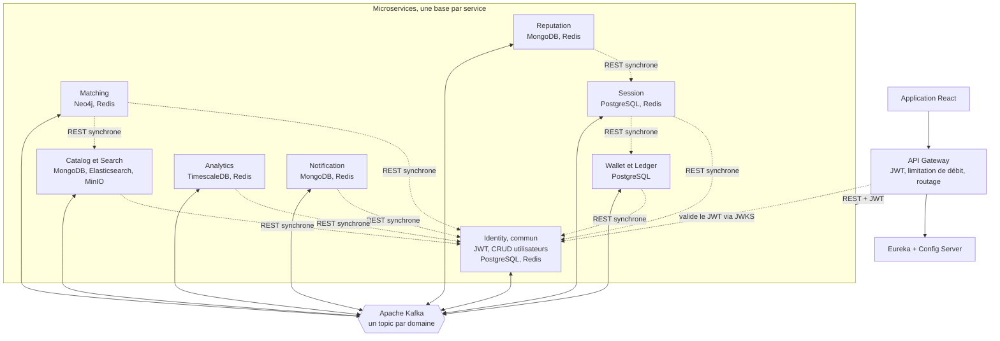

# Architecture globale de SkillLoop

```mermaid
flowchart TB
    Client[Application React]
    Gateway[API Gateway<br/>JWT, limitation de débit, routage]
    Eureka[Eureka + Config Server]

    Client --> Gateway
    Gateway -. valide le JWT via JWKS .-> Identity
    Gateway --> Eureka

    subgraph Services[Microservices, une base par service]
        Identity[Identity, commun<br/>JWT, CRUD utilisateurs<br/>PostgreSQL, Redis]
        Catalog[Catalog et Search<br/>MongoDB, Elasticsearch, MinIO]
        Matching[Matching<br/>Neo4j, Redis]
        Session[Session<br/>PostgreSQL, Redis]
        Wallet[Wallet et Ledger<br/>PostgreSQL]
        Reputation[Reputation<br/>MongoDB, Redis]
        Analytics[Analytics<br/>TimescaleDB, Redis]
        Notification[Notification<br/>MongoDB, Redis]
    end

    Gateway -->|REST + JWT| Services

    Kafka{{Apache Kafka<br/>un topic par domaine}}

    Identity <--> Kafka
    Catalog <--> Kafka
    Matching <--> Kafka
    Session <--> Kafka
    Wallet <--> Kafka
    Reputation <--> Kafka
    Analytics <--> Kafka
    Notification <--> Kafka

    Session -. REST synchrone .-> Wallet
    Session -. REST synchrone .-> Identity
    Matching -. REST synchrone .-> Catalog
    Matching -. REST synchrone .-> Identity
    Catalog -. REST synchrone .-> Identity
    Wallet -. REST synchrone .-> Identity
    Reputation -. REST synchrone .-> Session
    Notification -. REST synchrone .-> Identity
    Analytics -. REST synchrone .-> Identity
```
