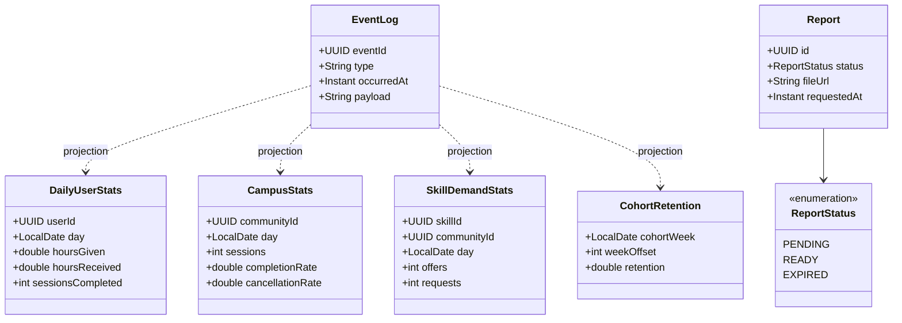

# Analytics & Impact Service : diagramme de classes

```mermaid
classDiagram
    class EventLog {
        +UUID eventId
        +String type
        +Instant occurredAt
        +String payload
    }
    class DailyUserStats {
        +UUID userId
        +LocalDate day
        +double hoursGiven
        +double hoursReceived
        +int sessionsCompleted
    }
    class CampusStats {
        +UUID communityId
        +LocalDate day
        +int sessions
        +double completionRate
        +double cancellationRate
    }
    class SkillDemandStats {
        +UUID skillId
        +UUID communityId
        +LocalDate day
        +int offers
        +int requests
    }
    class CohortRetention {
        +LocalDate cohortWeek
        +int weekOffset
        +double retention
    }
    class Report {
        +UUID id
        +ReportStatus status
        +String fileUrl
        +Instant requestedAt
    }
    class ReportStatus {
        <<enumeration>>
        PENDING
        READY
        EXPIRED
    }

    EventLog ..> DailyUserStats : projection
    EventLog ..> CampusStats : projection
    EventLog ..> SkillDemandStats : projection
    EventLog ..> CohortRetention : projection
    Report --> ReportStatus
```
