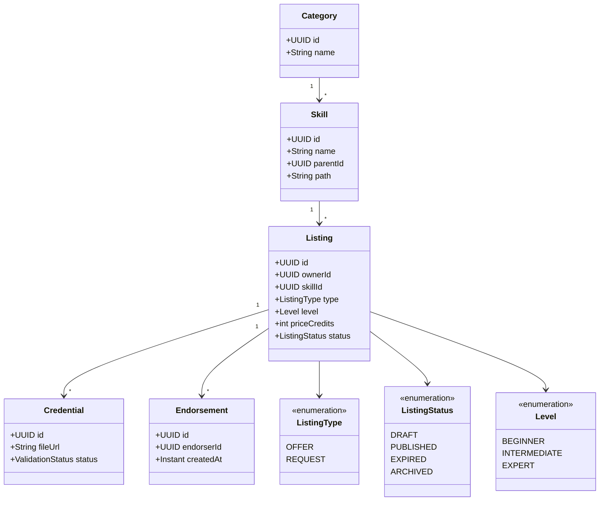

# Skill Catalog & Search Service : diagramme de classes

```mermaid
classDiagram
    class Skill {
        +UUID id
        +String name
        +UUID parentId
        +String path
    }
    class Category {
        +UUID id
        +String name
    }
    class Listing {
        +UUID id
        +UUID ownerId
        +UUID skillId
        +ListingType type
        +Level level
        +int priceCredits
        +ListingStatus status
    }
    class Credential {
        +UUID id
        +String fileUrl
        +ValidationStatus status
    }
    class Endorsement {
        +UUID id
        +UUID endorserId
        +Instant createdAt
    }
    class ListingType {
        <<enumeration>>
        OFFER
        REQUEST
    }
    class ListingStatus {
        <<enumeration>>
        DRAFT
        PUBLISHED
        EXPIRED
        ARCHIVED
    }
    class Level {
        <<enumeration>>
        BEGINNER
        INTERMEDIATE
        EXPERT
    }

    Category "1" --> "*" Skill
    Skill "1" --> "*" Listing
    Listing "1" --> "*" Credential
    Listing "1" --> "*" Endorsement
    Listing --> ListingType
    Listing --> ListingStatus
    Listing --> Level
```
