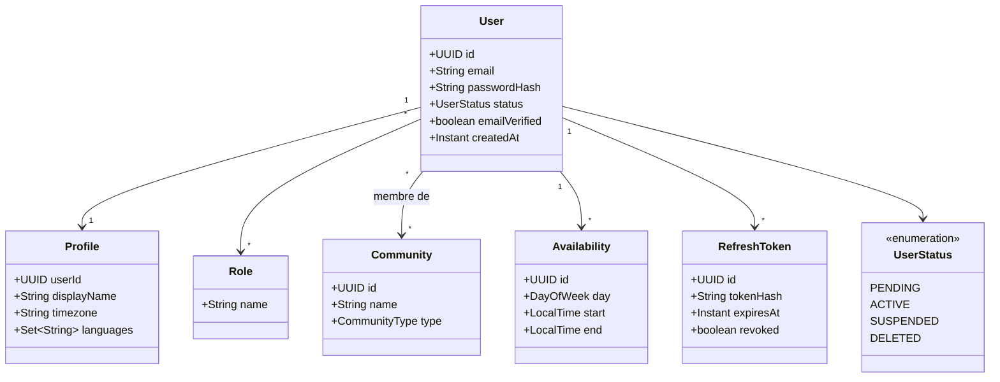

# Identity & Profile Service (commun) : diagramme de classes

```mermaid
classDiagram
    class User {
        +UUID id
        +String email
        +String passwordHash
        +UserStatus status
        +boolean emailVerified
        +Instant createdAt
    }
    class Profile {
        +UUID userId
        +String displayName
        +String timezone
        +Set~String~ languages
    }
    class Role {
        +String name
    }
    class Community {
        +UUID id
        +String name
        +CommunityType type
    }
    class Availability {
        +UUID id
        +DayOfWeek day
        +LocalTime start
        +LocalTime end
    }
    class RefreshToken {
        +UUID id
        +String tokenHash
        +Instant expiresAt
        +boolean revoked
    }
    class UserStatus {
        <<enumeration>>
        PENDING
        ACTIVE
        SUSPENDED
        DELETED
    }

    User "1" --> "1" Profile
    User "*" --> "*" Role
    User "*" --> "*" Community : membre de
    User "1" --> "*" Availability
    User "1" --> "*" RefreshToken
    User --> UserStatus
```
