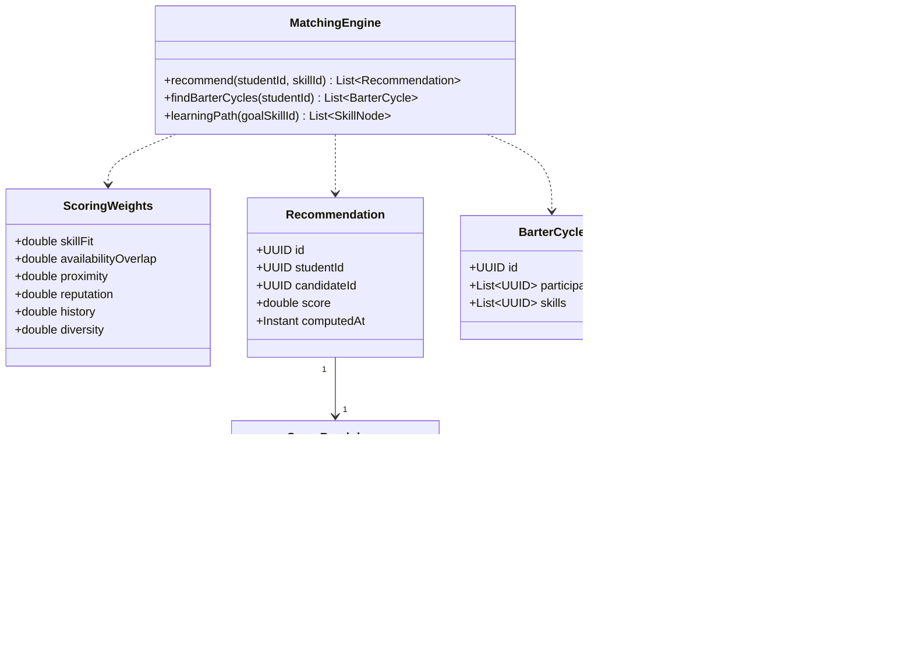

# Matching & Recommendation Service : diagramme de classes

```mermaid
classDiagram
    class StudentNode {
        +UUID studentId
        +UUID communityId
    }
    class SkillNode {
        +UUID skillId
        +String name
    }
    class Recommendation {
        +UUID id
        +UUID studentId
        +UUID candidateId
        +double score
        +Instant computedAt
    }
    class ScoreBreakdown {
        +double skillFit
        +double availabilityOverlap
        +double proximity
        +double reputation
        +double history
        +double diversity
    }
    class ScoringWeights {
        +double skillFit
        +double availabilityOverlap
        +double proximity
        +double reputation
        +double history
        +double diversity
    }
    class BarterCycle {
        +UUID id
        +List~UUID~ participants
        +List~UUID~ skills
    }
    class MatchingEngine {
        +recommend(studentId, skillId) List~Recommendation~
        +findBarterCycles(studentId) List~BarterCycle~
        +learningPath(goalSkillId) List~SkillNode~
    }

    StudentNode --> SkillNode : OFFRE
    StudentNode --> SkillNode : DEMANDE
    StudentNode --> StudentNode : A_AIDÉ
    SkillNode --> SkillNode : PRÉREQUIS
    Recommendation "1" --> "1" ScoreBreakdown
    MatchingEngine ..> ScoringWeights
    MatchingEngine ..> Recommendation
    MatchingEngine ..> BarterCycle
```
