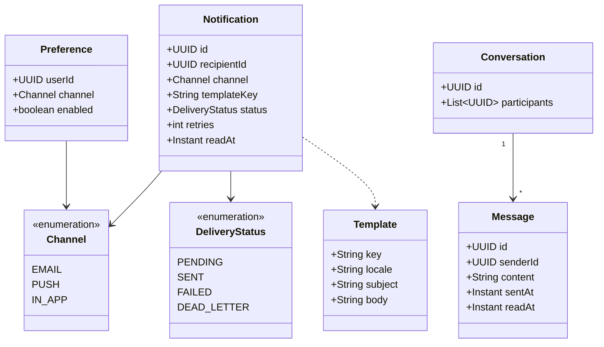

# Notification & Messaging Service : diagramme de classes

```mermaid
classDiagram
    class Notification {
        +UUID id
        +UUID recipientId
        +Channel channel
        +String templateKey
        +DeliveryStatus status
        +int retries
        +Instant readAt
    }
    class Template {
        +String key
        +String locale
        +String subject
        +String body
    }
    class Preference {
        +UUID userId
        +Channel channel
        +boolean enabled
    }
    class Conversation {
        +UUID id
        +List~UUID~ participants
    }
    class Message {
        +UUID id
        +UUID senderId
        +String content
        +Instant sentAt
        +Instant readAt
    }
    class Channel {
        <<enumeration>>
        EMAIL
        PUSH
        IN_APP
    }
    class DeliveryStatus {
        <<enumeration>>
        PENDING
        SENT
        FAILED
        DEAD_LETTER
    }

    Notification --> Channel
    Notification --> DeliveryStatus
    Notification ..> Template
    Preference --> Channel
    Conversation "1" --> "*" Message
```
