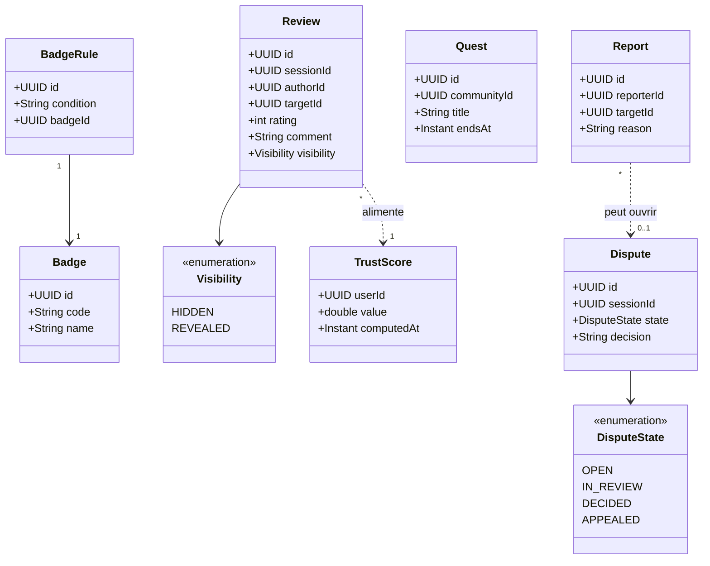

# Reputation, Trust & Moderation Service : diagramme de classes

```mermaid
classDiagram
    class Review {
        +UUID id
        +UUID sessionId
        +UUID authorId
        +UUID targetId
        +int rating
        +String comment
        +Visibility visibility
    }
    class TrustScore {
        +UUID userId
        +double value
        +Instant computedAt
    }
    class Badge {
        +UUID id
        +String code
        +String name
    }
    class BadgeRule {
        +UUID id
        +String condition
        +UUID badgeId
    }
    class Quest {
        +UUID id
        +UUID communityId
        +String title
        +Instant endsAt
    }
    class Report {
        +UUID id
        +UUID reporterId
        +UUID targetId
        +String reason
    }
    class Dispute {
        +UUID id
        +UUID sessionId
        +DisputeState state
        +String decision
    }
    class Visibility {
        <<enumeration>>
        HIDDEN
        REVEALED
    }
    class DisputeState {
        <<enumeration>>
        OPEN
        IN_REVIEW
        DECIDED
        APPEALED
    }

    Review --> Visibility
    Dispute --> DisputeState
    BadgeRule "1" --> "1" Badge
    Review "*" ..> "1" TrustScore : alimente
    Report "*" ..> "0..1" Dispute : peut ouvrir
```
