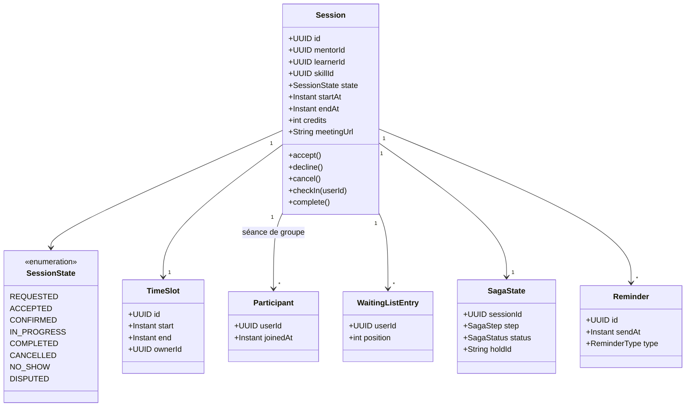

# Session & Scheduling Service : diagramme de classes

```mermaid
classDiagram
    class Session {
        +UUID id
        +UUID mentorId
        +UUID learnerId
        +UUID skillId
        +SessionState state
        +Instant startAt
        +Instant endAt
        +int credits
        +String meetingUrl
        +accept()
        +decline()
        +cancel()
        +checkIn(userId)
        +complete()
    }
    class SessionState {
        <<enumeration>>
        REQUESTED
        ACCEPTED
        CONFIRMED
        IN_PROGRESS
        COMPLETED
        CANCELLED
        NO_SHOW
        DISPUTED
    }
    class TimeSlot {
        +UUID id
        +Instant start
        +Instant end
        +UUID ownerId
    }
    class Participant {
        +UUID userId
        +Instant joinedAt
    }
    class WaitingListEntry {
        +UUID userId
        +int position
    }
    class SagaState {
        +UUID sessionId
        +SagaStep step
        +SagaStatus status
        +String holdId
    }
    class Reminder {
        +UUID id
        +Instant sendAt
        +ReminderType type
    }

    Session --> SessionState
    Session "1" --> "1" TimeSlot
    Session "1" --> "*" Participant : séance de groupe
    Session "1" --> "*" WaitingListEntry
    Session "1" --> "1" SagaState
    Session "1" --> "*" Reminder
```
