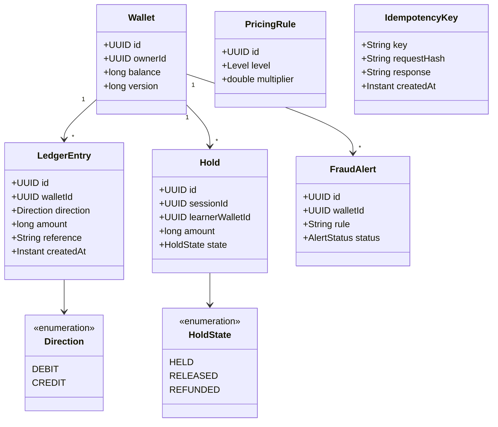

# Wallet & Credit Ledger Service : diagramme de classes

```mermaid
classDiagram
    class Wallet {
        +UUID id
        +UUID ownerId
        +long balance
        +long version
    }
    class LedgerEntry {
        +UUID id
        +UUID walletId
        +Direction direction
        +long amount
        +String reference
        +Instant createdAt
    }
    class Hold {
        +UUID id
        +UUID sessionId
        +UUID learnerWalletId
        +long amount
        +HoldState state
    }
    class PricingRule {
        +UUID id
        +Level level
        +double multiplier
    }
    class IdempotencyKey {
        +String key
        +String requestHash
        +String response
        +Instant createdAt
    }
    class FraudAlert {
        +UUID id
        +UUID walletId
        +String rule
        +AlertStatus status
    }
    class Direction {
        <<enumeration>>
        DEBIT
        CREDIT
    }
    class HoldState {
        <<enumeration>>
        HELD
        RELEASED
        REFUNDED
    }

    Wallet "1" --> "*" LedgerEntry
    Wallet "1" --> "*" Hold
    Wallet "1" --> "*" FraudAlert
    LedgerEntry --> Direction
    Hold --> HoldState
```
