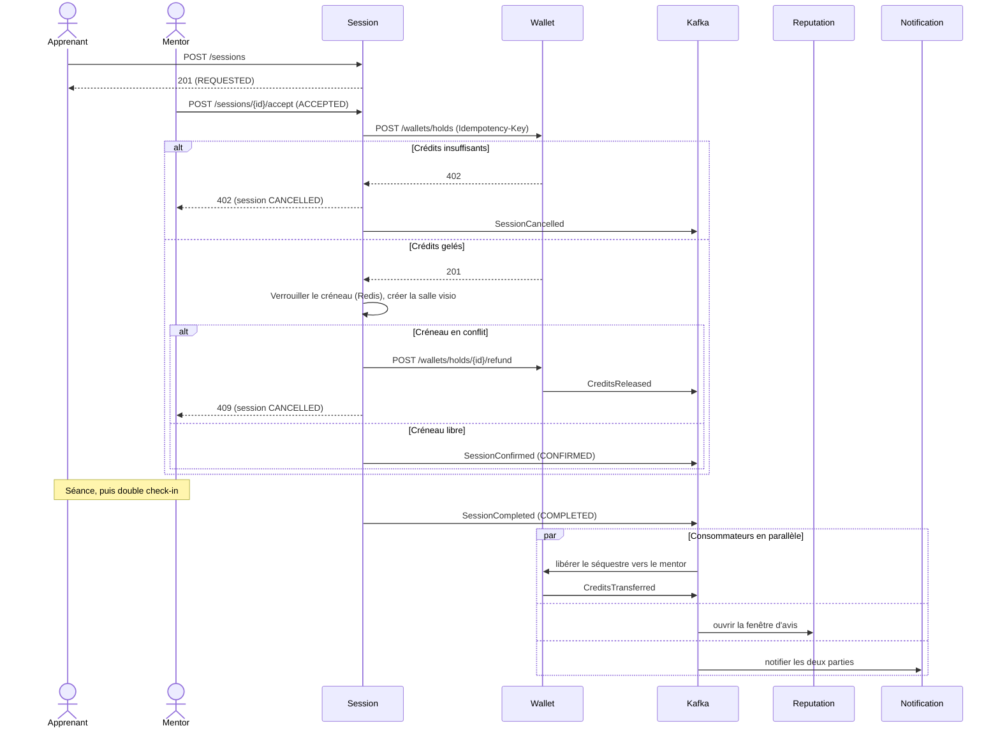

# Saga de réservation (orchestrée par Session)

```mermaid
sequenceDiagram
    actor L as Apprenant
    actor M as Mentor
    participant S as Session
    participant W as Wallet
    participant K as Kafka
    participant R as Reputation
    participant N as Notification

    L->>S: POST /sessions
    S-->>L: 201 (REQUESTED)
    M->>S: POST /sessions/{id}/accept (ACCEPTED)
    S->>W: POST /wallets/holds (Idempotency-Key)
    alt Crédits insuffisants
        W-->>S: 402
        S-->>M: 402 (session CANCELLED)
        S->>K: SessionCancelled
    else Crédits gelés
        W-->>S: 201
        S->>S: Verrouiller le créneau (Redis), créer la salle visio
        alt Créneau en conflit
            S->>W: POST /wallets/holds/{id}/refund
            W->>K: CreditsReleased
            S-->>M: 409 (session CANCELLED)
        else Créneau libre
            S->>K: SessionConfirmed (CONFIRMED)
        end
    end

    Note over L,M: Séance, puis double check-in
    S->>K: SessionCompleted (COMPLETED)
    par Consommateurs en parallèle
        K->>W: libérer le séquestre vers le mentor
        W->>K: CreditsTransferred
    and
        K->>R: ouvrir la fenêtre d'avis
    and
        K->>N: notifier les deux parties
    end
```
